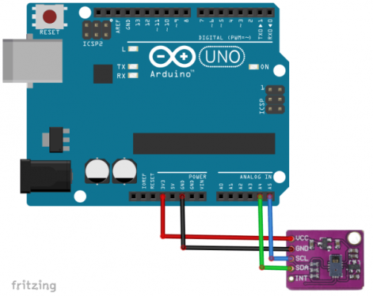

# Play Pacman with PAJ7620 and Arduino

Play Pacman game using PAJ7620 sensor and Arduino.

<picture>
  
</picture>

#### Connection Diagram:

<picture>
  
</picture>

#### How to use this code:
_Note_: Mentioned instructions below are applicable after building and wiring the complete circuit for PAJ7620 with Arduino as clarified in Connection Diagram.

1. Download all files from this repo. on your computer.
2. Open `ArduinoCode` directory in Arduino IDE.
3. Upload this code [`Gesture.ino`](/ArduinoCode/Gesture.ino) on your Arduino board.
4. Run Python script [`serial-listener.py`](/serial-listener.py) on your computer.
5. Open Pacman game and start playing using your hand.

Watch the implementation of this code on our YouTube channel:
https://www.youtube.com/@Roboticxps

To get your own tools by visiting our online store:
https://roboticx.ps/

#### Follow us on social media:

* Facebook: https://www.facebook.com/Roboticxps
* Instagram: https://www.instagram.com/roboticx.ps/
